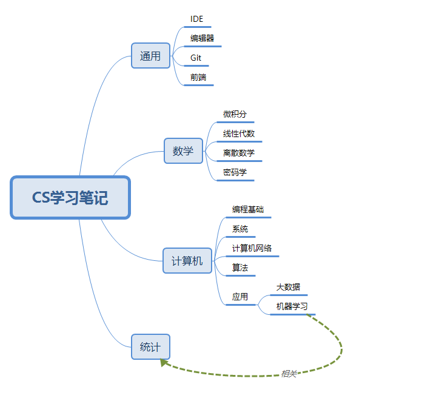

# learning-notes

这是一个用来记录自己学习笔记的仓库。

## Why github

在此之前也使用过onenote，Evernote这样的笔记本，其中OneNote对于记录一些包含代码的笔记来说，不是很友好。想要使用Markdown，需要添加插件。Evernote虽然支持markdown，但是在移动端也只能查看，无法修改。既然都不能修改，为何不使用vscode+github的组合呢？而且GitHub也推出了移动端，想要查看笔记也比较方便。最主要的是，vscode对markdown的支持非常好。在写笔记的时候如果还需要敲代码，就不需要在切换到笔记应用上去了。

## How to organise

如何整理笔记也是比较头疼的一件事。学生时代一直使用纸质的笔记本，而且当时个人比较懒惰，并没有形成系统的笔记结构。后来使用onenote和evernote，也是为了学习英语，结构相对比较单一。现在想要记录CS相关的课程内容，包含很多代码也有很多零碎的小技巧，信息相对杂乱，需要一套完整的笔记系统来支撑。这里用一张思维导图来体现：

## What to record

这部分自己也在学习中。记得多了难免摘抄，记得少了时间一长又需要重新翻看资料，浪费时间。于是记什么将成为自己最主要的目标，解决了这个，笔记问题也就基本搞定了。目前来讲，有以下四点：

1. **基础概念**。这部分既重要又不重要，重要性不言而喻，而之所以不重要是因为你随时随地可以找见这些概念。所以可以适量记录，对于重难点可以多写点，简单的就一笔带过了。
2. **举例说明**。这部分多为代码，写清楚，自己能明白即可。
3. **思维导图**。对于庞杂的系统概念，最好可以辅之思维导图以更好理解和记忆。
4. **实践练习**。笔记都是次要，写好代码比什么都强。这部分如果代码量少，可以添加在笔记中；大型项目单独列出。
